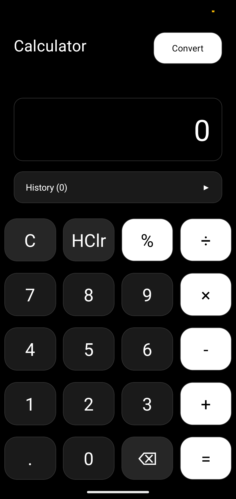
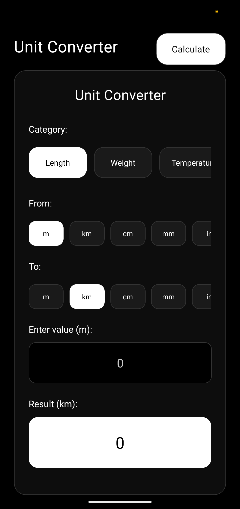

# Calculator

A clean calculator app with unit conversion built in React Native.

  
  &nbsp;&nbsp;&nbsp;
  

## Features

**Calculator:** Basic arithmetic, popup history, percentage operations  
**Unit Converter:** Length, weight, temperature, volume conversions  
**Design:** Pure dark theme, responsive layout

## Usage

**Calculator:** Tap numbers and operators, press = for results, tap History for past calculations  
**Converter:** Tap Convert button, select category and units, enter value for instant conversion